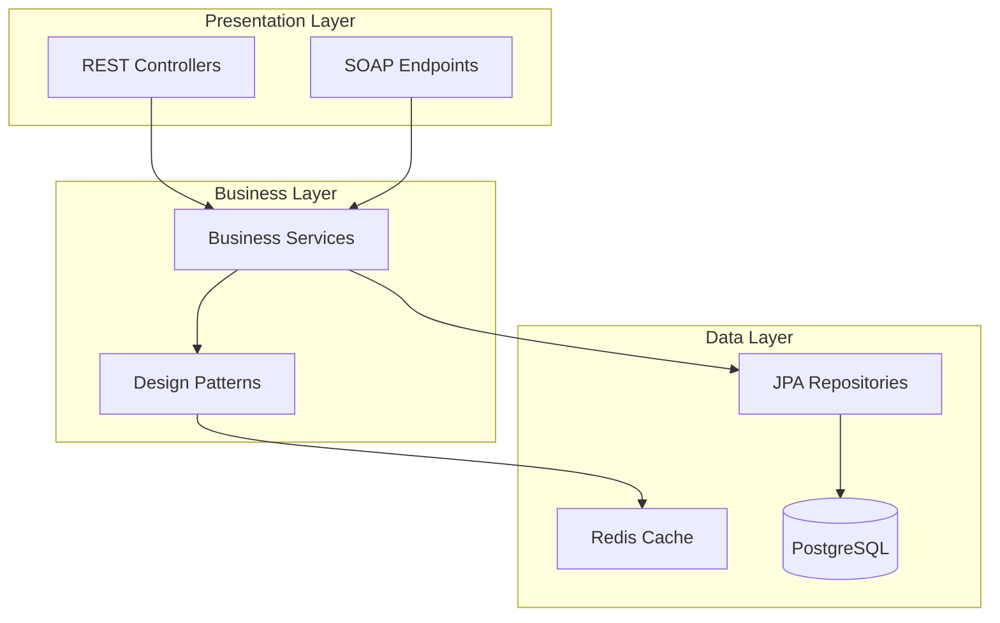
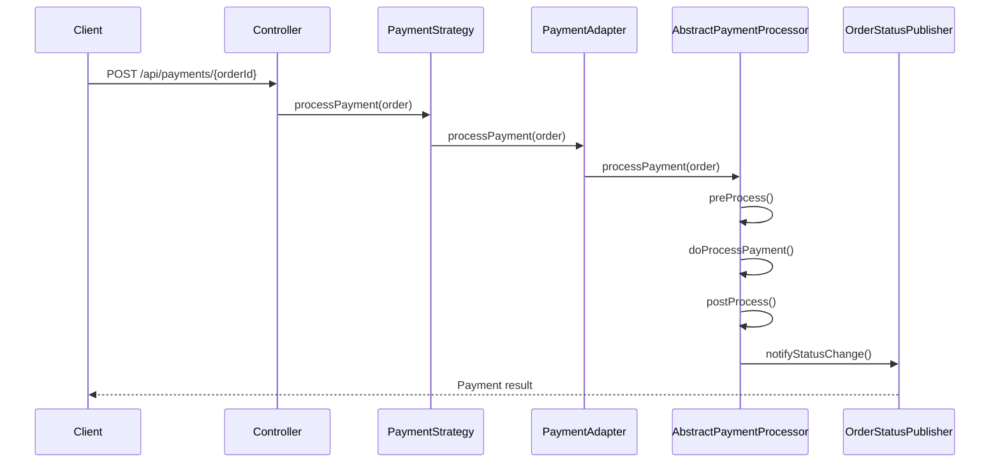
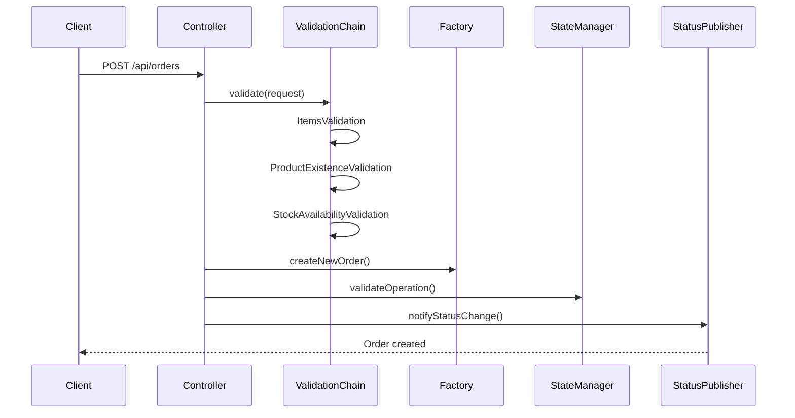
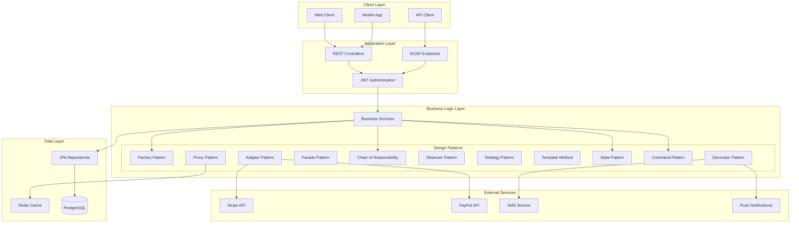
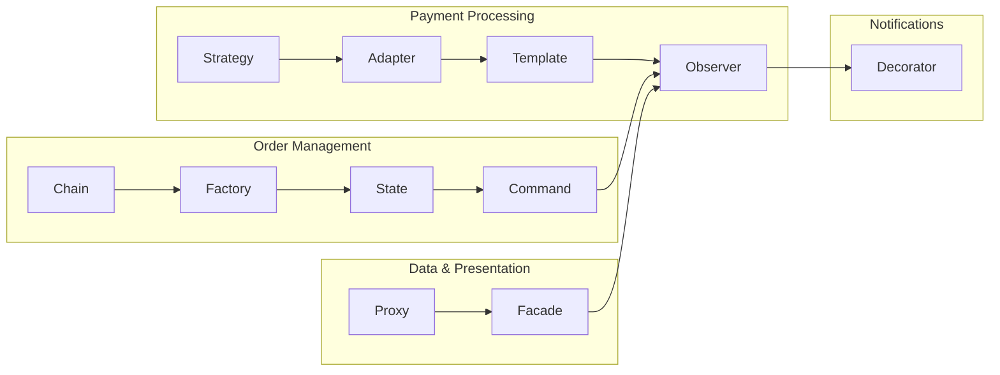

# Architecture Guide

This document provides a comprehensive overview of the Smart E-Commerce Platform's architecture, focusing on the implementation of 11 design patterns and their interactions within the system.

## Table of Contents

- [System Overview](#system-overview)
- [Design Patterns Implementation](#design-patterns-implementation)
- [Pattern Interactions](#pattern-interactions)
- [Package Structure](#package-structure)
- [Architecture Diagrams](#architecture-diagrams)
- [Design Decisions](#design-decisions)

## System Overview

The Smart E-Commerce Platform is built using a layered architecture with clear separation of concerns. The system demonstrates sophisticated use of design patterns to solve real-world problems in e-commerce domain:

- **Flexible Payment Processing** - Multiple payment providers with unified interface
- **Intelligent Caching** - Performance optimization with Redis
- **Robust Order Management** - State-driven order lifecycle
- **Extensible Notifications** - Multi-channel notification system
- **Validation Pipeline** - Flexible order validation chain



## Design Patterns Implementation

### Creational Patterns (1)

#### Factory Pattern
**Location**: `factory/` package  
**Purpose**: Standardized entity creation with consistent initialization

```java
public class OrderFactory {
    public static Order createNewOrder(UUID userId, BigDecimal total, List<OrderItem> items) {
        return Order.builder()
                .userId(userId)
                .total(total)
                .status(OrderStatus.PENDING)
                .createdAt(Instant.now())
                .items(items)
                .build();
    }
}
```

**Benefits**:
- Consistent object initialization
- Centralized creation logic
- Easy to modify creation rules
- Supports complex object construction

**Usage**: Used throughout the system for creating `Order`, `Product`, `User`, `OrderItem`, and `Inventory` entities.

### Structural Patterns (3)

#### Adapter Pattern
**Location**: `adapter/` package  
**Purpose**: Integrate third-party payment providers with unified interface

```java
@Component("stripePayment")
public class StripePaymentAdapter extends AbstractPaymentProcessor {
    
    @Override
    protected PaymentResponseDTO doProcessPayment(Order order) {
        // Convert our data to Stripe's expected format
        String customerId = "cust_" + order.getUserId().toString().substring(0, 8);
        BigDecimal amountInCents = order.getTotal().multiply(BigDecimal.valueOf(100));
        
        // Call Stripe's API
        StripePaymentResult result = stripeGateway.createPaymentIntent(customerId, amountInCents, "usd");
        
        // Convert Stripe's response to our standard format
        OrderStatus orderStatus = convertStripeStatusToOrderStatus(result.status);
        return new PaymentResponseDTO(order.getId(), orderStatus);
    }
}
```

**Benefits**:
- Seamless integration with external APIs
- Consistent internal interface
- Easy to add new payment providers
- Isolates external API changes

#### Proxy Pattern
**Location**: `proxy/` package  
**Purpose**: Add Redis caching layer without modifying core services

```java
@Component
public class ProductServiceCachingProxy implements ProductServiceContract {
    
    @Override
    public Product findById(UUID id) {
        String cacheKey = PRODUCT_CACHE_PREFIX + id;
        
        // Try cache first
        String cached = redisTemplate.opsForValue().get(cacheKey);
        if (cached != null) {
            return objectMapper.readValue(cached, Product.class);
        }
        
        // Cache miss - delegate to real service
        Product product = delegate.findById(id);
        
        // Cache the result
        redisTemplate.opsForValue().set(cacheKey, 
            objectMapper.writeValueAsString(product), CACHE_TTL);
        
        return product;
    }
}
```

**Benefits**:
- Transparent caching layer
- No changes to existing service code
- Configurable caching strategies
- Performance optimization

#### Facade Pattern
**Location**: `mapper/` package  
**Purpose**: Simplified interface for complex mapping operations

```java
@Component
public final class MapperFacade {
    private static final OrderMapper orderMapper = new OrderMapper();
    private static final ProductMapper productMapper = new ProductMapper();

    public static OrderResponseDTO toResponseDTO(Order order) {
        return orderMapper.toResponseDTO(order);
    }

    public static ProductResponseDTO toResponseDTO(Product product) {
        return productMapper.toResponseDTO(product);
    }
}
```

**Benefits**:
- Simplified client interface
- Centralized mapping logic
- Easy to extend with new mappers
- Consistent response format

### Behavioral Patterns (7)

#### Chain of Responsibility Pattern
**Location**: `validation/` package  
**Purpose**: Flexible order validation pipeline

```java
public abstract class OrderValidationHandler {
    private OrderValidationHandler nextHandler;
    
    public final ValidationResult validate(CreateOrderRequestDTO request) {
        ValidationResult result = doValidate(request);
        
        if (result.isValid() && nextHandler != null) {
            return nextHandler.validate(request);
        }
        
        return result;
    }
    
    protected abstract ValidationResult doValidate(CreateOrderRequestDTO request);
}
```

**Validation Chain**:
1. `ItemsValidationHandler` - Validates order items exist
2. `ProductExistenceValidationHandler` - Checks products exist in database
3. `StockAvailabilityValidationHandler` - Verifies inventory availability

**Benefits**:
- Flexible validation pipeline
- Easy to add/remove validation steps
- Single responsibility per validator
- Configurable validation order

#### Observer Pattern
**Location**: `observer/` package  
**Purpose**: Event-driven notifications for order status changes

```java
@Component
public class OrderStatusPublisher {
    private final List<OrderStatusObserver> observers;
    
    public void notifyStatusChange(Order order, OrderStatus oldStatus, OrderStatus newStatus) {
        observers.stream()
                .filter(observer -> observer.shouldNotify(oldStatus, newStatus))
                .forEach(observer -> observer.onStatusChanged(order, oldStatus, newStatus));
    }
}
```

**Observers**:
- `OrderNotificationObserver` - Sends notifications to customers
- `InventoryReleaseObserver` - Releases inventory on cancellation
- `LoyaltyPointsObserver` - Awards points on successful orders
- `OrderAuditObserver` - Logs order changes
- `PaymentFailureObserver` - Handles payment failures

**Benefits**:
- Loose coupling between components
- Easy to add new observers
- Event-driven architecture
- Separation of concerns

#### Strategy Pattern
**Location**: `payment/` package  
**Purpose**: Multiple payment processing strategies

```java
public interface PaymentStrategy {
    PaymentResponseDTO processPayment(Order order);
}

// Implementations:
// - CreditCardPaymentStrategy
// - MockPaymentStrategy (for testing)
// - StripePaymentAdapter (via Adapter pattern)
// - PayPalPaymentAdapter (via Adapter pattern)
```

**Benefits**:
- Runtime strategy selection
- Easy to add new payment methods
- Consistent payment interface
- Testable payment logic

#### Template Method Pattern
**Location**: `payment/` package  
**Purpose**: Consistent payment processing workflow

```java
public abstract class AbstractPaymentProcessor implements PaymentStrategy {
    
    @Override
    public final PaymentResponseDTO processPayment(Order order) {
        preProcess(order);
        PaymentResponseDTO response = doProcessPayment(order);
        postProcess(order, response);
        return response;
    }
    
    protected abstract PaymentResponseDTO doProcessPayment(Order order);
    protected abstract String getProviderName();
    
    protected void preProcess(Order order) {
        // Common pre-processing logic
    }
    
    protected void postProcess(Order order, PaymentResponseDTO response) {
        // Common post-processing logic
    }
}
```

**Benefits**:
- Consistent processing workflow
- Shared common logic
- Customizable specific steps
- Enforced processing order

#### State Pattern
**Location**: `state/` package  
**Purpose**: Order lifecycle management with state-specific behavior

```java
@Component
public class OrderStateManager {
    
    public boolean canProcessPayment(Order order) {
        OrderState state = getStateForOrder(order);
        return state.canProcessPayment();
    }
    
    private OrderState getStateForOrder(Order order) {
        return switch (order.getStatus()) {
            case PENDING -> new PendingOrderState();
            case PAID -> new PaidOrderState();
            case CANCELLED -> new CancelledOrderState();
        };
    }
}
```

**States**:
- `PendingOrderState` - Allows payment and cancellation
- `PaidOrderState` - Allows refund only
- `CancelledOrderState` - No operations allowed

**Benefits**:
- Clear state transitions
- State-specific behavior
- Prevents invalid operations
- Easy to add new states

#### Command Pattern
**Location**: `command/` package  
**Purpose**: Encapsulate operations with undo capability

```java
public interface Command {
    CommandResult execute() throws Exception;
    CommandResult undo() throws Exception;
    boolean supportsUndo();
    String getDescription();
}

// Implementations:
// - CreateOrderCommand
// - CancelOrderCommand
```

**Benefits**:
- Undoable operations
- Operation logging
- Request queuing capability
- Audit trail support

#### Decorator Pattern
**Location**: `decorator/` package  
**Purpose**: Flexible notification channel composition

```java
public abstract class NotificationDecorator implements NotificationService {
    protected NotificationService wrappedService;
    
    public NotificationDecorator(NotificationService notificationService) {
        this.wrappedService = notificationService;
    }
}

// Usage:
NotificationService service = new SmsNotificationDecorator(
    new PushNotificationDecorator(
        new BasicNotificationService()
    )
);
```

**Decorators**:
- `SmsNotificationDecorator` - Adds SMS notifications
- `PushNotificationDecorator` - Adds push notifications
- `SlackNotificationDecorator` - Adds Slack notifications

**Benefits**:
- Runtime composition
- Multiple notification channels
- Easy to add new channels
- Flexible combinations

## Pattern Interactions

### Payment Processing Flow


### Order Creation with Validation


## Package Structure

```
com.example.ecommerce/
├── adapter/              # Adapter Pattern - Payment provider adapters
├── command/              # Command Pattern - Undoable operations
│   └── order/           # Order-specific commands
├── config/              # Spring configuration classes
├── constants/           # Application constants
├── controller/          # REST controllers
├── decorator/           # Decorator Pattern - Notification decorators
├── domain/              # Core business entities
├── dto/                 # Data Transfer Objects
│   ├── request/         # Request DTOs
│   └── response/        # Response DTOs
├── enums/               # Enumeration classes
├── event/               # Event handling (Observer pattern support)
├── external/            # External service integrations
├── factory/             # Factory Pattern - Entity factories
├── jobs/                # Scheduled jobs (Quartz)
├── mapper/              # Facade Pattern - Entity mappers
├── observer/            # Observer Pattern - Event observers
├── payment/             # Strategy & Template Method - Payment processing
├── proxy/               # Proxy Pattern - Caching proxies
├── repository/          # JPA repositories
├── security/            # Security and validation
├── service/             # Business services
├── soap/                # SOAP web services
├── state/               # State Pattern - Order state management
├── util/                # Utility classes
└── validation/          # Chain of Responsibility - Validation handlers
```

## Architecture Diagrams

### System Architecture Overview


### Design Pattern Relationships


## Design Decisions

### Why These Patterns?

#### Factory Pattern
- **Problem**: Inconsistent entity creation across the application
- **Solution**: Centralized creation logic with proper initialization
- **Benefit**: Ensures all entities are created with correct default values

#### Adapter Pattern
- **Problem**: Different APIs for payment providers (Stripe, PayPal)
- **Solution**: Unified interface that adapts external APIs
- **Benefit**: Easy to add new payment providers without changing business logic

#### Proxy Pattern
- **Problem**: Database queries for frequently accessed products
- **Solution**: Transparent caching layer using Redis
- **Benefit**: Improved performance without changing existing code

#### Chain of Responsibility
- **Problem**: Complex order validation with multiple rules
- **Solution**: Flexible validation pipeline
- **Benefit**: Easy to add/remove validation rules

#### Observer Pattern
- **Problem**: Multiple actions needed when order status changes
- **Solution**: Event-driven notifications
- **Benefit**: Loose coupling between order management and side effects

#### Strategy Pattern
- **Problem**: Different payment processing logic for different providers
- **Solution**: Runtime strategy selection
- **Benefit**: Easy to add new payment methods

#### Template Method Pattern
- **Problem**: Common payment processing steps with provider-specific logic
- **Solution**: Template with customizable steps
- **Benefit**: Consistent workflow with flexibility

#### State Pattern
- **Problem**: Complex order state transitions and validations
- **Solution**: State-specific behavior encapsulation
- **Benefit**: Clear state management and validation

#### Command Pattern
- **Problem**: Need for undoable operations and audit trail
- **Solution**: Encapsulate operations as objects
- **Benefit**: Undo capability and operation logging

#### Decorator Pattern
- **Problem**: Flexible notification channel combinations
- **Solution**: Runtime composition of notification services
- **Benefit**: Multiple notification channels without explosion of classes

### Technology Integration

#### Redis Integration (Proxy Pattern)
- **Granular Caching**: Individual products cached separately
- **List Invalidation**: Product lists invalidated on changes
- **TTL Management**: Different cache durations for different data types

#### Database Design
- **JPA Entities**: Clean domain models
- **Liquibase Migrations**: Version-controlled schema changes
- **Repository Pattern**: Data access abstraction

#### Security Architecture
- **JWT Authentication**: Stateless authentication
- **Ownership Validation**: Resource access control
- **Method-level Security**: Fine-grained authorization

---

## 🔗 Navigation

| Previous | Home | Next |
|----------|------|------|
| [← Main README](../README.md) | [🏠 Home](../README.md) | [Technology Stack →](TECHNOLOGY_STACK.md) |

**Quick Links:**
- [🏗️ Architecture Overview](#system-overview)
- [🎨 Design Patterns](#design-patterns-implementation)
- [🔄 Pattern Interactions](#pattern-interactions)
- [📦 Package Structure](#package-structure)
- [📊 Architecture Diagrams](#architecture-diagrams)

[⬆️ Back to Top](#architecture-guide)