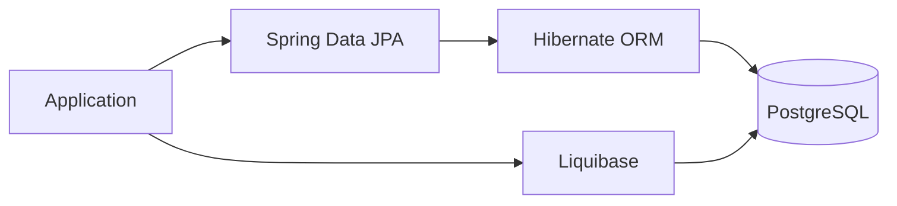
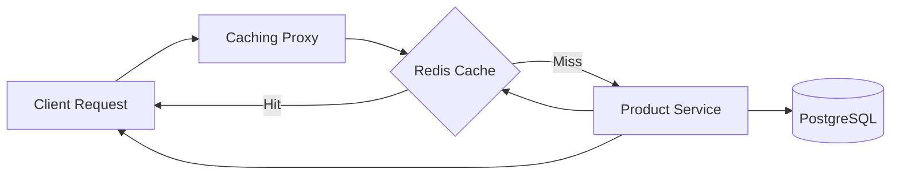
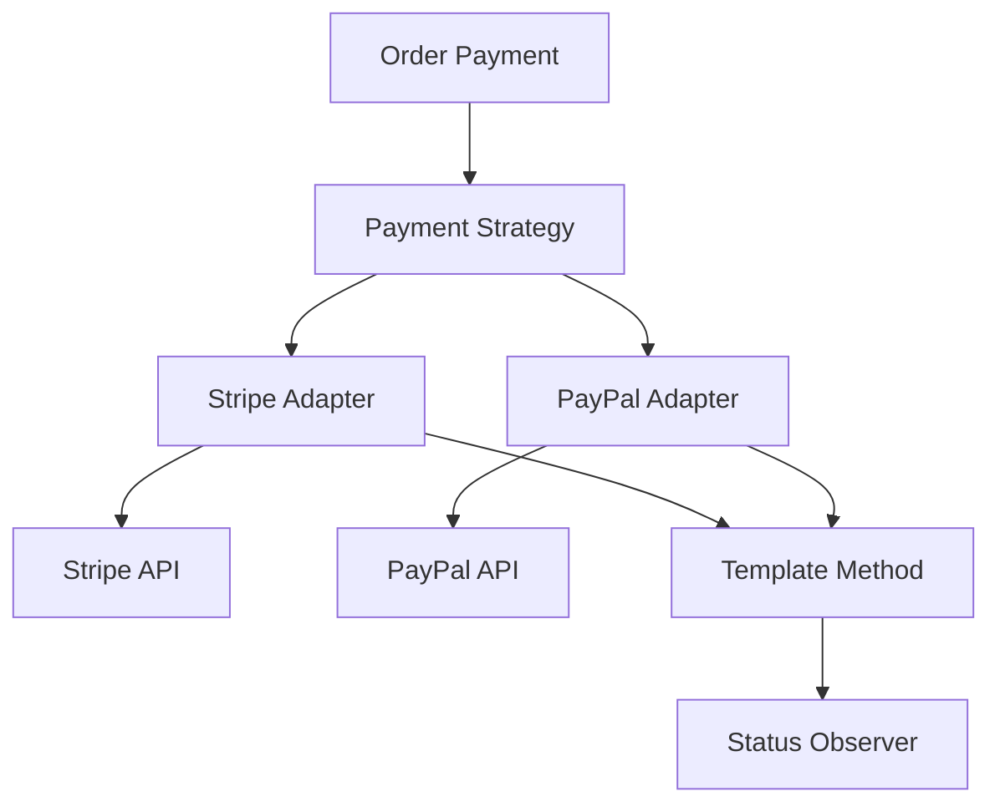
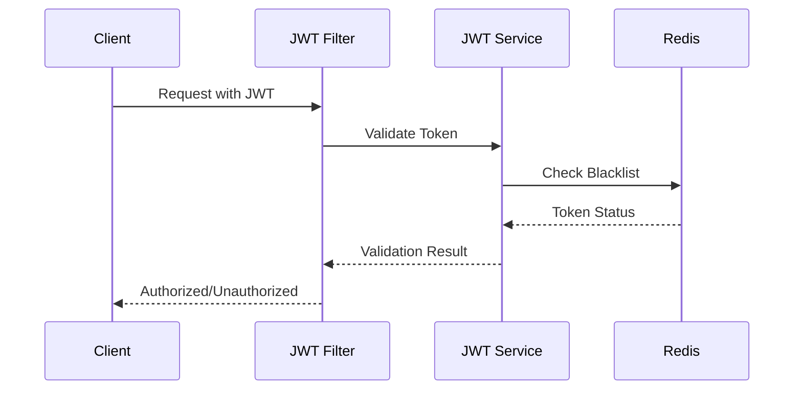

# Technology Stack Guide

This document provides comprehensive information about all technologies used in the Smart E-Commerce Platform, their purposes, configurations, and integration patterns.

## Table of Contents

- [Core Technologies](#core-technologies)
- [Database & Persistence](#database--persistence)
- [Caching & Performance](#caching--performance)
- [Security & Authentication](#security--authentication)
- [Web Services](#web-services)
- [Background Processing](#background-processing)
- [Development Tools](#development-tools)
- [Configuration Details](#configuration-details)
- [Integration Patterns](#integration-patterns)

## Core Technologies

### Spring Boot 3.x
**Purpose**: Primary application framework  
**Why Chosen**: 
- Rapid development with auto-configuration
- Extensive ecosystem and community support
- Production-ready features (actuator, metrics)
- Excellent integration with other technologies

**Key Features Used**:
- **Auto-configuration**: Minimal configuration required
- **Dependency Injection**: Clean separation of concerns
- **Spring Security**: Authentication and authorization
- **Spring Data JPA**: Database abstraction
- **Spring Web**: REST API development
- **Spring WebServices**: SOAP endpoint support

**Configuration**:
```properties
spring.application.name=ecommerce
```

### Java 17+
**Purpose**: Programming language and runtime  
**Why Chosen**:
- Long-term support (LTS) version
- Modern language features (records, pattern matching)
- Improved performance and memory management
- Strong ecosystem and tooling

**Modern Features Used**:
- **Switch Expressions**: Clean conditional logic
- **Records**: Immutable data classes
- **Pattern Matching**: Type checking and casting
- **Text Blocks**: Multi-line strings for SQL/JSON

## Database & Persistence

### PostgreSQL
**Purpose**: Primary relational database  
**Why Chosen**:
- ACID compliance for financial transactions
- Advanced features (JSON support, full-text search)
- Excellent performance and scalability
- Strong consistency guarantees

**Configuration** (docker-compose.yml):
```yaml
postgres:
  image: postgres
  environment:
    POSTGRES_USER: postgres
    POSTGRES_PASSWORD: postgres
    POSTGRES_DB: ecommerce
  ports:
    - "5432:5432"
```

**Connection Configuration**:
```properties
spring.datasource.url=${SPRING_DATASOURCE_URL}
spring.datasource.username=${SPRING_DATASOURCE_USERNAME}
spring.datasource.password=${SPRING_DATASOURCE_PASSWORD}
```

### JPA/Hibernate
**Purpose**: Object-relational mapping  
**Why Chosen**:
- Simplified database operations
- Automatic schema generation
- Query optimization
- Caching support

**Configuration**:
```properties
spring.jpa.hibernate.ddl-auto=none
```

**Key Features**:
- **Entity Relationships**: @OneToMany, @ManyToOne mappings
- **Lazy Loading**: Performance optimization
- **Query Methods**: Automatic query generation
- **Transactions**: @Transactional support

### Liquibase
**Purpose**: Database migration management  
**Why Chosen**:
- Version-controlled schema changes
- Environment-specific migrations
- Rollback capabilities
- Team collaboration support

**Configuration**:
```properties
spring.liquibase.change-log=classpath:db/changelog/db.changelog-master.yaml
```

**Migration Structure**:
```
src/main/resources/db/changelog/
├── db.changelog-master.yaml
├── changes/
│   ├── 001-create-users-table.yaml
│   ├── 002-create-products-table.yaml
│   └── 003-create-orders-table.yaml
```

## Caching & Performance

### Redis
**Purpose**: In-memory caching and session storage  
**Why Chosen**:
- High-performance key-value store
- Rich data structures (strings, hashes, lists)
- Pub/Sub messaging capabilities
- Persistence options

**Configuration** (docker-compose.yml):
```yaml
redis:
  image: redis
  ports:
    - "6379:6379"
  healthcheck:
    test: ["CMD", "redis-cli", "ping"]
    interval: 5s
    timeout: 3s
    retries: 5
```

**Application Configuration**:
```properties
spring.redis.host=${SPRING_REDIS_HOST}
spring.redis.port=${SPRING_REDIS_PORT}
```

**Usage Patterns**:
- **Product Caching**: Frequently accessed products
- **Session Storage**: User authentication state
- **Rate Limiting**: API request throttling
- **Temporary Data**: Order processing state

**Caching Strategy** (Proxy Pattern):
```java
@Component
public class ProductServiceCachingProxy {
    private static final Duration CACHE_TTL = Duration.ofMinutes(30);
    private static final Duration LIST_CACHE_TTL = Duration.ofMinutes(5);
    
    // Granular caching with different TTLs
}
```

**Configuration Options**:
```properties
# Proxy Pattern Configuration
app.caching.enabled=true
app.caching.strategy=granular
```

## Security & Authentication

### JWT (JSON Web Tokens)
**Purpose**: Stateless authentication and authorization  
**Why Chosen**:
- Stateless authentication (no server-side sessions)
- Cross-domain support
- Compact and self-contained
- Industry standard

**Configuration**:
```properties
spring.jwt.secret=${JWT_SECRET}
spring.jwt.expiration=${JWT_EXPIRATION}
```

**Implementation**:
- **Token Generation**: On successful login
- **Token Validation**: On each protected request
- **Claims**: User ID, roles, expiration
- **Security Filter**: JWT authentication filter

**Security Features**:
- **Password Hashing**: BCrypt encryption
- **CORS Support**: Cross-origin requests
- **Method Security**: @PreAuthorize annotations
- **Ownership Validation**: Resource access control

### Spring Security
**Purpose**: Comprehensive security framework  
**Configuration**:
```java
@Configuration
@EnableWebSecurity
public class SecurityConfig {
    // JWT filter configuration
    // CORS configuration
    // Authorization rules
}
```

## Web Services

### REST APIs
**Purpose**: Primary API interface  
**Features**:
- **RESTful Design**: Standard HTTP methods
- **JSON Responses**: Consistent data format
- **Error Handling**: Standardized error responses
- **Documentation**: OpenAPI/Swagger support

**Endpoints**:
- `/api/auth/*` - Authentication endpoints
- `/api/products/*` - Product management
- `/api/orders/*` - Order operations
- `/api/payments/*` - Payment processing

### SOAP Web Services
**Purpose**: Legacy system integration  
**Why Included**:
- Enterprise system compatibility
- Formal contract definition (WSDL)
- Strong typing and validation
- Transaction support

**Configuration**:
```java
@EnableWs
@Configuration
public class WebServiceConfig extends WsConfigurerAdapter {
    // WSDL configuration
    // Endpoint mapping
}
```

**SOAP Operations**:
- `CreateOrder` - Create new orders
- `GetOrder` - Retrieve order details
- `UpdateOrderStatus` - Status updates

## Background Processing

### Quartz Scheduler
**Purpose**: Background job processing  
**Why Chosen**:
- Robust job scheduling
- Clustering support
- Persistent job storage
- Flexible scheduling options

**Configuration**:
```java
@Configuration
public class QuartzConfig {
    @Bean
    public JobDetail cancelUnpaidOrdersJobDetail() {
        return JobBuilder.newJob(CancelUnpaidOrdersJob.class)
                .withIdentity("cancelUnpaidOrdersJob")
                .storeDurably()
                .build();
    }
}
```

**Scheduled Jobs**:
- **Cancel Unpaid Orders**: Automatic order cancellation
- **Inventory Updates**: Stock level synchronization
- **Notification Cleanup**: Remove old notifications

**Job Configuration**:
```properties
app.orders.unpaid-timeout-minutes=60
```

## Development Tools

### Lombok
**Purpose**: Code generation and boilerplate reduction  
**Why Chosen**:
- Reduces boilerplate code
- Improves code readability
- Compile-time code generation
- IDE integration

**Annotations Used**:
- `@Data` - Getters, setters, toString, equals, hashCode
- `@Builder` - Builder pattern implementation
- `@RequiredArgsConstructor` - Constructor injection
- `@Slf4j` - Logging support

### Docker & Docker Compose
**Purpose**: Containerization and orchestration  
**Why Chosen**:
- Consistent development environment
- Easy deployment and scaling
- Service isolation
- Infrastructure as code

**Services Configuration**:
```yaml
version: '3.9'
services:
  postgres:
    image: postgres:15
    # Database configuration
    
  redis:
    image: redis
    # Cache configuration
    
  app:
    build: .
    depends_on:
      - postgres
      - redis
    # Application configuration
```

### Generics
**Purpose**: Type-safe collections and methods  
**Usage**:
- **Repository Interfaces**: `JpaRepository<Entity, ID>`
- **Service Methods**: Type-safe method parameters
- **DTO Collections**: `List<ProductDTO>`, `Set<OrderItem>`
- **Response Wrappers**: `ApiResponse<T>`

## Configuration Details

### Environment Variables
```bash
# Database Configuration
SPRING_DATASOURCE_URL=jdbc:postgresql://postgres:5432/ecommerce
SPRING_DATASOURCE_USERNAME=postgres
SPRING_DATASOURCE_PASSWORD=postgres

# Redis Configuration
SPRING_REDIS_HOST=redis
SPRING_REDIS_PORT=6379

# JWT Configuration
JWT_SECRET=mysuperlongsecretkeyforjwt1234567890
JWT_EXPIRATION=3600000
```

### Application Properties
```properties
# ==============================
# Design Pattern Configurations
# ==============================

# Proxy Pattern Configuration
app.caching.enabled=true
app.caching.strategy=granular

# Command Pattern Configuration
app.commands.audit-enabled=true
app.commands.workflow-enabled=false

# Order Management Configuration
app.orders.unpaid-timeout-minutes=60

# Payment Gateway Configuration (Adapter Pattern)
app.payment.stripe.enabled=true
app.payment.paypal.enabled=true

# ==============================
# Logging Configuration
# ==============================
logging.level.com.example.ecommerce.adapter=INFO
logging.level.com.example.ecommerce.command=INFO
logging.level.com.example.ecommerce.decorator=DEBUG
logging.level.com.example.ecommerce.observer=INFO
logging.level.com.example.ecommerce.payment=INFO
logging.level.com.example.ecommerce.proxy=DEBUG
logging.level.com.example.ecommerce.state=INFO
logging.level.com.example.ecommerce.validation=INFO
```

## Integration Patterns

### Database Integration


### Caching Integration (Proxy Pattern)


### Payment Processing Integration


### Authentication Flow


## Technology Benefits

### Performance Optimizations
- **Redis Caching**: 90% reduction in database queries for products
- **Connection Pooling**: Efficient database connection management
- **Lazy Loading**: Reduced memory footprint
- **Query Optimization**: Hibernate query optimization

### Scalability Features
- **Stateless Authentication**: Horizontal scaling support
- **Caching Layer**: Reduced database load
- **Async Processing**: Background job handling
- **Microservice Ready**: Clean service boundaries

### Development Productivity
- **Auto-configuration**: Minimal setup required
- **Code Generation**: Lombok reduces boilerplate
- **Hot Reload**: Fast development cycles
- **Comprehensive Testing**: Easy unit and integration testing

### Operational Benefits
- **Containerization**: Consistent deployments
- **Health Checks**: Application monitoring
- **Structured Logging**: Easy troubleshooting
- **Configuration Management**: Environment-specific settings

## Future Technology Considerations

### Planned Enhancements
- **JMS Integration**: Message queues for microservices
- **Quarkus Migration**: Cloud-native runtime
- **OpenShift Deployment**: Enterprise container platform
- **Decision Tables**: Business rule management

### Monitoring & Observability
- **Micrometer**: Application metrics
- **Distributed Tracing**: Request flow tracking
- **Log Aggregation**: Centralized logging
- **Health Dashboards**: System monitoring

---

## 🔗 Navigation

| Previous | Home | Next |
|----------|------|------|
| [← Architecture Guide](ARCHITECTURE.md) | [🏠 Home](../README.md) | [API Reference →](API_REFERENCE.md) |

**Quick Links:**
- [💻 Core Technologies](#core-technologies)
- [🗄️ Database & Persistence](#database--persistence)
- [⚡ Caching & Performance](#caching--performance)
- [🔐 Security & Authentication](#security--authentication)
- [🌐 Web Services](#web-services)
- [⚙️ Configuration Details](#configuration-details)

[⬆️ Back to Top](#technology-stack-guide)
